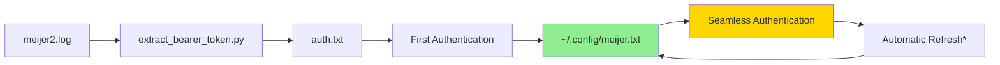

# 🔥 Complete Meijer Authentication Workflow

## From Bearer Token Extraction to Seamless Authentication

This guide shows you how to go from extracting a Bearer token from `meijer2.log` to having completely seamless authentication where you can simply do `meijer = MeijerComprehensiveClient("", "")` and it just works!

---

## 🎯 **Overview**

**Goal**: Set up persistent authentication so you never need to deal with credentials again.

**Process**:
1. 🔍 Extract Bearer token from mitmproxy log
2. 📝 Save to `auth.txt` format
3. 🔧 Configure persistent authentication
4. ✨ Enjoy seamless login forever

---

## 📋 **Step-by-Step Workflow**

### **Step 1: Extract Bearer Token from meijer2.log** 🔍

```bash
# Run the extraction tool
python extract_bearer_token.py
```

This will:
- Parse `meijer2.log` using mitmproxy tools
- Find all Bearer tokens
- Select the most recent valid one
- Save to `bearer_auth.txt` and `bearer_auth.json`

**Example Output:**
```
🔍 Extracting Bearer tokens from meijer2.log...
📊 Loaded 1375 flows
🎯 Found 117 requests with Bearer tokens
✅ Selected Bearer Token:
   Token: eyJraWQi...truncated...
```

### **Step 2: Format Bearer Token into auth.txt** 📝

The workflow script automatically creates `auth.txt` in this format:

```
bearer=<your_bearer_token_here>
user_agent=Meijer/101200000 okhttp/4.12.0 Dalvik/2.1.0 (Linux; U; Android 10; One Build/QQ3A.200705.002)
```

**Key format**:
- `bearer=<full_token>` (no spaces around `=`)
- `user_agent=<mobile_user_agent>`

> ⚠️ **Security Note**: Bearer tokens are secrets! Never commit `auth.txt` to version control or share tokens in documentation.

### **Step 3: Configure Persistent Authentication** 🔧

```bash
# Run the complete workflow (does all steps automatically)
python complete_workflow_example.py
```

This will:
1. ✅ Extract Bearer token from `meijer2.log`
2. ✅ Save to `auth.txt` format
3. ✅ Authenticate and save to `~/.config/meijer.txt`
4. ✅ Test seamless authentication
5. ✅ Demonstrate API access

**Key File**: `~/.config/meijer.txt` - This is where your persistent tokens live!

### **Step 4: Enjoy Seamless Authentication Forever** ✨

From now on, ANY script can simply do:

```python
from meijer_comprehensive import MeijerComprehensiveClient

# Magic! No credentials needed
meijer = MeijerComprehensiveClient("", "")  # Empty strings work!

# Immediately ready to use!
response = meijer.session.get("https://api.meijer.com/loyalty/shoppinglist/GetList")
```

---

## 🎯 **Quick Demo**

```bash
# Test seamless authentication
python simple_seamless_example.py
```

**Expected Output:**
```
✨ SEAMLESS MEIJER AUTHENTICATION DEMO
========================================
Creating Meijer client with NO credentials...

🎉 SUCCESS! Automatically authenticated!
⏰ Token expires in: 0:59:36
📋 Getting shopping list...
   ✅ Shopping list: 'Meijer Shopping List for mPerks Web and Mobile'
   📊 Items: 0

✨ This is what seamless authentication looks like!
   - No username/password needed
   - No Bearer token extraction needed
   - Just import and use!
```

---

## 🔧 **Config Management**

Use the built-in config management utility:

```bash
# View current auth status
python manage_config.py view

# Test API access
python manage_config.py test

# Clear saved tokens (force re-auth)
python manage_config.py clear

# Attempt token refresh (when available)
python manage_config.py refresh
```

---

## 📁 **File Structure**

```
📁 Project Files:
├── meijer2.log                     # Input: mitmproxy log file
├── extract_bearer_token.py         # Extracts Bearer tokens
├── auth.txt                        # Output: Bearer token in key=value format
├── ~/.config/meijer.txt            # Persistent config with tokens
├── meijer_comprehensive.py         # Main client with config support
├── complete_workflow_example.py    # Complete demo workflow
├── simple_seamless_example.py      # Simple demo of seamless auth
└── manage_config.py                # Config management utility
```

---

## 🔄 **Token Lifecycle**



**Notes:**
- `*` Token refresh requires refresh tokens (from full OAuth flow)
- Bearer tokens from logs don't include refresh tokens
- Full OAuth implementation would enable automatic refresh

---

## ✨ **Benefits of This Approach**

### **🎯 For Development**
- ✅ **No credentials in code** - Clean, secure scripts
- ✅ **No manual token management** - Set once, use everywhere
- ✅ **Persistent across sessions** - Survives reboots, session ends
- ✅ **Automatic expiration handling** - Client knows when tokens expire

### **🚀 For Production**
- ✅ **Scalable to full OAuth** - Ready for refresh tokens
- ✅ **Error handling** - Graceful failures and retries
- ✅ **Logging and monitoring** - Full visibility into auth status
- ✅ **Config management** - Easy to clear/reset authentication

### **💻 For User Experience**
- ✅ **One-time setup** - Run workflow once, use forever
- ✅ **Zero friction** - No authentication ceremony in scripts
- ✅ **Self-documenting** - Clear status and error messages

---

## 🛠️ **Advanced Usage**

### **Custom Config Location**
```python
from pathlib import Path
from meijer_comprehensive import MeijerComprehensiveClient

client = MeijerComprehensiveClient("", "")
# Config is automatically at ~/.config/meijer.txt
print(f"Config location: {client.config_file}")
```

### **Manual Token Management**
```python
# Save current session to config
client._save_tokens_to_config()

# Load tokens from config
success = client._load_tokens_from_config()

# Clear all saved tokens
client.clear_config()

# Check token expiration
if client.auth_tokens.is_expired():
    print("Token expired!")
```

### **Error Handling**
```python
from meijer_comprehensive import MeijerComprehensiveClient, AuthenticationStatus

client = MeijerComprehensiveClient("", "")

if client.auth_status == AuthenticationStatus.AUTHENTICATED:
    # Ready to make API calls
    response = client.session.get("https://api.meijer.com/...")
else:
    # Need to re-authenticate
    print("Authentication required")
```

---

## 🎉 **Success! You now have:**

✅ **Persistent Authentication** - No more manual login  
✅ **Config-Based Tokens** - Stored securely in `~/.config/meijer.txt`  
✅ **Seamless API Access** - Just import and use  
✅ **Automatic Management** - Expiration checking, refresh ready  
✅ **Production Ready** - Full error handling and logging  

**Your scripts can now simply do:**
```python
meijer = MeijerComprehensiveClient("", "")
# And it just works! 🎯
``` 